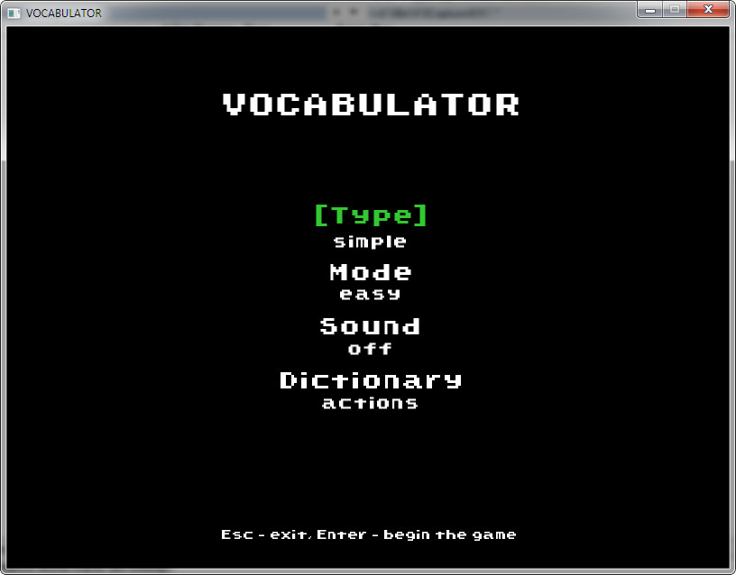

# Vocabulator
It's a simple game with words that helps to improve your vocabulary.

## Third Party
Vocabulator uses external projects enumerated below:
1. https://github.com/SFML/SFML
2. https://github.com/effolkronium/random
3. https://github.com/SergiusTheBest/plog
4. https://github.com/hyperrealm/libconfig

## How to build
1. git clone --recurse-submodules https://github.com/m110h/vocabulator.git
2. cd vocabulator
3. mkdir build
4. cd build
5. cmake ..
6. make

An output executable file will be placed in vocabulator/bin directory.

## Screenshot

